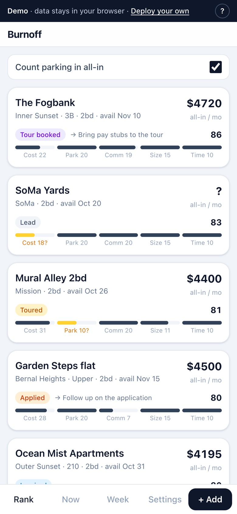
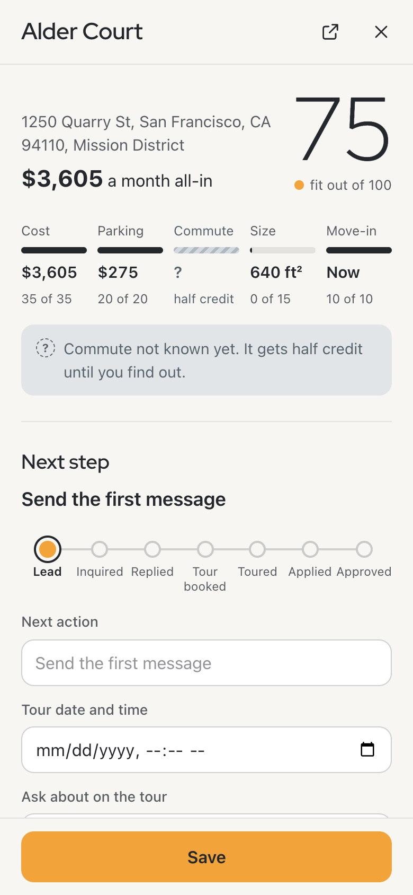
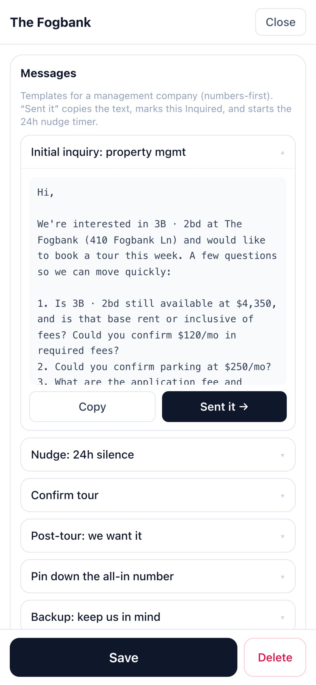
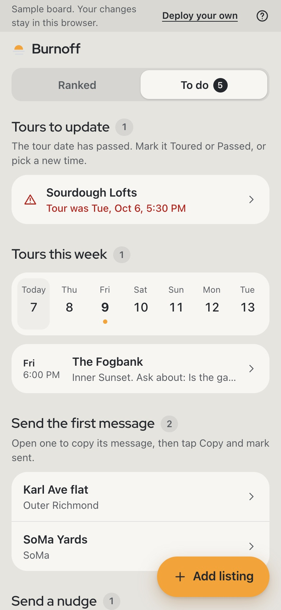

# Burnoff

*Clear the fog at will, not on Karl's time.*

Burnoff is a phone-first board for apartment hunting in San Francisco, alone or with whoever you're moving with. Paste in a listing and Claude pulls out the numbers. Every place gets a score based on what it will actually cost you each month, and the app tells you who to message next. We were approved for our apartment three days after I got to SF.

**Try the demo at [burnoff-sf.vercel.app](https://burnoff-sf.vercel.app).** It opens on a board of invented listings for two friends searching together. Anything you add stays in your browser, and paste-to-parse makes a live call to Claude.

<!-- Screenshots: the live demo at a 390x844 phone viewport. Files are in docs/screenshots/. -->
<p>
  
  
  
  
</p>

## Why I built it

SF fog (locals call it Karl) burns off when it decides to. A listing has its own fog: the real monthly cost, whether parking exists, which fees are required. Burnoff lets you clear it yourself, early enough to tour and apply before someone else does. The playbook I wrote before the move said to tour within 24 hours of a listing going up and apply the same day.

On August 30 I got to San Francisco with a week to find an apartment. I asked Claude for a simple app my partner and I could both use to track tours and outreach. It built a shared board as an artifact and told me I didn't need anything more. I pushed back, because the loop eating my day was finding a listing, retyping a message, sending it, and forgetting who I'd already chased.

The artifact went through about seven versions in two days. Each rebuild got fresh storage and a new link to re-send to my partner, who needed a Claude account just to open it. Zillow also rate-limited Claude in the middle of a task. So it became a real app on Vercel, built with Claude Code from a written spec. One rule came straight from the instructions in my first planning chat: "Unknown is an acceptable answer. Fabrication is not." It became the parse prompt and the amber flag on every unknown.

Our application was approved on September 2, and I signed on September 3.

In October I came back to make it public, and the board wouldn't load. Upstash had archived the free database after it sat idle, and the lock screen called that a wrong passcode. That's fixed, and it's why this README has a section on archiving. Making it public also meant taking us out of it. Some templates only made sense for our household, and the app assumed you had a "partner." Now it works solo or with anyone. You write how messages should describe the other person ("my sister", "my cofounder"), or leave it blank and every message says "I".

## Who built it, and how

I've spent 19 years in customer and operator roles, the last several in data infrastructure: customer data platforms, event tracking, reverse ETL. My description of how I work, from my last project: "I read code and make the product and data calls; I don't write the Python by hand. That makes the specification the real work." Here it was TypeScript. Claude Code wrote it, I directed the architecture, checked what it produced, and ran every git command myself.

On every job I've had, the first fix was the record a system reads from, before trusting what it says. Here the record was a pile of listings that each quoted price a different way.

My earlier build is [Continental Divide](https://github.com/cedson-cloud/continental-divide), an event-governance tool where the model drafts and deterministic rules decide.

## The job it does

Good units often go in a couple of days. These are the jobs a hunter has in the first 24 hours after a listing appears, and the app is built around them in this order.

1. **Capture the listing from anywhere.** Copy the page text, paste it in, and one Claude call fills in rent, fees, square footage, parking, each unit, move-in date and a "hook" (one detail worth mentioning in your first message). It works on Zillow, Craigslist, a building's own site, or anything else with text on it. Anything the page doesn't say stays blank.
2. **Know what it really costs.** Some buildings quote base rent, some include required fees, and almost none include parking. Burnoff adds rent, plus required fees when the price is base rent, plus parking if you count it, so every listing compares on the same number.
3. **Score it before contacting anyone.** 100 points from your own criteria: cost 35, parking 20, commute 20, size 15, move-in 10, rescaled to 80 when you don't need parking. Unknowns get half credit and an amber flag, so a listing with missing details stays in the running and shows you what to ask.
4. **Send a first message that doesn't read like the other fifty.** Individual owners decide on people and speed, while property managers decide on paperwork and turnaround, so the first inquiry has a version for each. The listing's hook drops into it. There are also drafts for the 24-hour nudge, tour confirmation, "we want it", pinning down the all-in number, and the backup ask.
5. **Start a clock.** Tap Sent it and the listing is timestamped. After 24 hours of silence it shows up in the Now tab's nudge queue, next to replies with no tour booked and tours whose date has passed.
6. **Book the tour and see the week.** Week is a seven-day tour calendar that skips a day you've blocked.
7. **Keep whoever you're searching with in sync.** One shared board on both phones, with a URL and a passcode instead of accounts.

Edits show up right away and wait on your phone until the server confirms them, so a dead zone on Muni doesn't lose anything. Add it to your home screen and it opens like an app.

## Decisions and what I cut

**Nothing is scraped.** Listing sites block cloud servers. Your browser already has the page open, so you copy the text and the model does the tedious part. It also covers listings the big sites miss. One building's one-bedroom never showed up on Zillow at all. I found it on the building's own site after Claude told me no such unit existed.

**Unknowns stay unknown.** I tried having Claude look up missing rents with web search first. The search index hadn't crawled a listing posted the day before, and fresh listings are exactly the ones worth chasing. The parse prompt forbids guessing, and scoring treats a blank as half credit with a flag.

**A URL and a passcode instead of accounts.** The person you're searching with should be up and running in under a minute, on their phone, in the middle of a move. That's thin protection. It's fine for two people who trust each other, and it's the first thing I'd replace.

**Free tiers are part of the spec.** Vercel Hobby, the Upstash free plan, and one model call per parse. Polling stops when the tab is hidden so two phones stay inside Redis's free limits.

**No application paperwork.** With no real accounts, the app shouldn't hold anything you'd hate to see leak. Settings says not to store SSNs, bank numbers or income documents. Those go straight to the landlord.

**Designed to run unattended.** The public demo has no database to archive and no passcode to leak. Anthropic enforces a monthly spend cap on the demo's key, the server caps how much pasted text it sends, and if a live parse fails for any reason the demo shows a saved sample with a note saying so.

Cut along the way: URL scraping, embedded maps, user accounts, an ORM and a state library. The trade-offs I'd revisit, and where each one breaks, are in [DECISIONS.md](DECISIONS.md). How one codebase runs as both the public demo and a private board is in [docs/design-demo-mode.md](docs/design-demo-mode.md).

## How I tested it

Claude Code's first report said the app was built, tested end to end, and passed every acceptance criterion. I treated that as a claim to check, starting with the message templates. One of them said something about us that wasn't true, and a message had already gone out with it. I had Claude Code print every template, before and after, and fact-checked each claim line by line. The audit found a second false claim, and the rule now is that templates only say what the profile says.

For the public version, `npm test` runs 86 unit tests on the parts that can lose your edits or spend money: the offline write queue, the merge that keeps a sync from overwriting an unsent edit, the passcode and mode guards, the parse length caps, the demo's parse fallback, and the demo data. `npm run smoke` checks the API and a real parse end to end. Before launch, the production build was searched for the API key and every other secret value, and none of them reach the browser. The demo was checked with curl and on my phone. The gaps are listed in [DECISIONS.md #9](DECISIONS.md).

## What I learned building it with AI

- **Don't make the model fetch what you're already looking at.** Pasting the page beats any scraper and works everywhere.
- **A search index lags the live web.** The newest listings are the ones the model can't see.
- **"All tests pass" from a coding agent is where checking starts.** Ask what would be silently wrong, and test that.
- **AI-written outreach can say false things about you.** Read every claim in a template before it goes to a landlord.
- **The model will argue against your need if you let it.** It said I didn't need an app. The real bottleneck was the outreach loop, and only I could see that.
- **Pick the tool by what it can see.** Chat for naming, positioning and judgment calls. Claude Code for anything in the repo, because it can read the files and show a diff.

## Demo mode and real mode

Same code, switched by one environment variable (`BURNOFF_MODE`).

| | Demo (burnoff-sf.vercel.app) | Real (your own copy) |
|---|---|---|
| Where the board lives | Your browser only | Your Upstash database, shared |
| Who sees it | Just you, on that device | Anyone with the URL and passcode |
| Paste-to-parse | Live, with a shorter input limit | Live |
| Good for | Looking around | An actual search |

## Use it for your own search

You don't need to know how to code. You need about 20 minutes and free accounts with GitHub, Vercel and Anthropic. Hosting and the database cost nothing. Parsing runs on your Anthropic account, so you'll add a few dollars of credit.

[](https://vercel.com/new/clone?repository-url=https%3A%2F%2Fgithub.com%2Fcedson-cloud%2Fburnoff-sf&env=ANTHROPIC_API_KEY,BOARD_ID,BOARD_PASSCODE&envDescription=An%20Anthropic%20API%20key%20for%20paste-to-parse%2C%20plus%20a%20board%20ID%20and%20passcode%20you%20make%20up.&envLink=https%3A%2F%2Fgithub.com%2Fcedson-cloud%2Fburnoff-sf%23use-it-for-your-own-search&project-name=burnoff&repository-name=burnoff)

1. Get an Anthropic API key. At [console.anthropic.com](https://console.anthropic.com), add a few dollars of credit, then create a key under API Keys. Set a monthly spend limit while you're there.
2. Make up a board ID and a passcode. The board ID becomes part of your private URL, so make it long and random (a password manager can generate 30 letters and numbers). The passcode has to be at least 12 characters, because nothing slows down someone guessing it. You type it once per phone, so three or four random words work well.
3. Click Deploy with Vercel. Sign in with GitHub, paste in the three values, and deploy. Vercel copies the code to your GitHub and builds it. Your site will show an "unreachable" screen at first because it has no database yet. That's expected.
4. Add the database. In your Vercel project, open Storage, create a database, and pick Upstash for Redis on the free plan. If it asks for an environment variable prefix, use `KV`. Connect it to your project.
5. Redeploy. Under Deployments, open the latest one, choose Redeploy, and wait for it to finish so the app picks up the database.
6. Open your board at your site's address plus `/b/` and your board ID, like `your-project.vercel.app/b/<BOARD_ID>`, and enter the passcode. The plain site address never shows strangers where your board is, so use the full link the first time on each device. After that, the plain address opens your board on that device.
7. Fill in Settings: your budget, commute anchor, move-in window and name. If you're searching with someone, add them and how messages should describe them.
8. Put it on your home screen. On iPhone in Safari, tap Share, then Add to Home Screen. On Android in Chrome, tap ⋮, then Add to Home screen.
9. If you're searching with someone, send them the board link (the one with `/b/`) and the passcode. That's their whole setup.

These are the settings the app reads. None of them ever reach the browser.

| Variable | What it is | Where it comes from |
|---|---|---|
| `ANTHROPIC_API_KEY` | Your Anthropic API key, used only for parsing | Step 1 |
| `BOARD_ID` | Long random string that becomes your URL (`/b/<BOARD_ID>`) | Step 2 |
| `BOARD_PASSCODE` | The shared passcode, at least 12 characters, entered once per device | Step 2 |
| `KV_REST_API_URL` | Upstash database address | Set by Vercel in step 4 |
| `KV_REST_API_TOKEN` | Upstash database token | Set by Vercel in step 4 |
| `PARSE_MODEL` | Optional. Overrides the Claude model used for parsing | Leave unset |

## If your board stops loading

Upstash archives a free database after at least 14 days with no activity, and sends warning emails first. If your search pauses for a couple of weeks, expect it. Your board will show "unreachable" instead of your listings.

Your data isn't gone. Upstash keeps a backup when it archives, and [you can restore it from their console](https://upstash.com/docs/redis/help/faq):

1. Sign in to the [Upstash console](https://console.upstash.com) and create a new free database.
2. Restore the archived backup into it.
3. In Vercel, connect the new database to your project (prefix `KV`), remove the old one, and redeploy.

If you've already signed a lease and don't need the old listings, skip the restore and just connect a fresh database. That's what I did. To avoid all of this, open the board every week or so while you're still searching. Each visit counts as activity.

## Run it locally

```bash
npm install
cp .env.example .env.local   # fill in the five required values
npm run dev                  # http://localhost:3000
npm test                     # unit tests
npm run smoke                # with the dev server running; add -- --parse for a real Claude call
```

Set `BURNOFF_MODE=demo` in `.env.local` to run the demo locally. It only needs `ANTHROPIC_API_KEY`.

Stack: Next.js 15, React 19, TypeScript, Tailwind v4, Upstash Redis, and the Anthropic SDK with structured outputs. Hosted on Vercel Hobby.

## Honest limitations

It was built for one search over a couple of weeks, by two people, and some choices stop working past that. The passcode is thin protection. If two people edit the same listing offline, the later save wins without a warning. Sync polls every 15 seconds instead of pushing. Scoring thresholds are in Settings, but the curve shapes are hardcoded. Real mode has no export button, and with no signal a cold open shows nothing. Each one, with the fix I'd make, is in [DECISIONS.md](DECISIONS.md).

## Privacy

The repo has no real names, phone numbers or addresses. Your details live in your own database, entered through Settings. In the demo, your board never leaves your browser. Text you paste for parsing goes through the server to Anthropic, and the app doesn't store it. Application paperwork stays out of the app entirely.

## License

[MIT](LICENSE). Built by Calvin Edson with [Claude Code](https://claude.com/claude-code).
