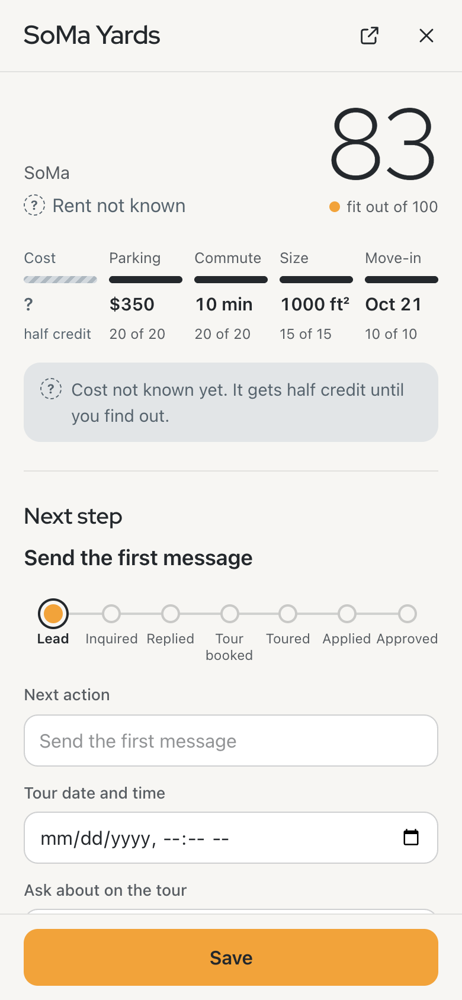
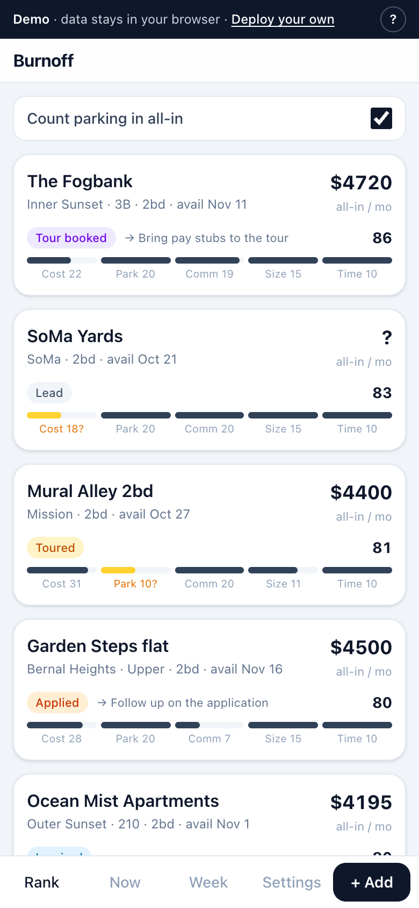
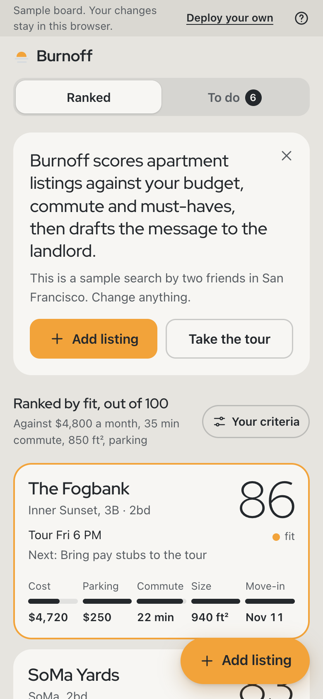
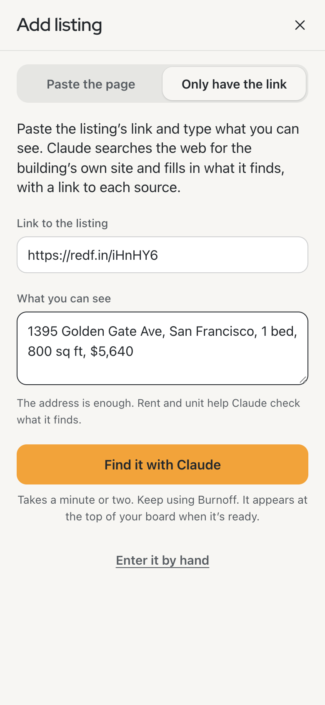
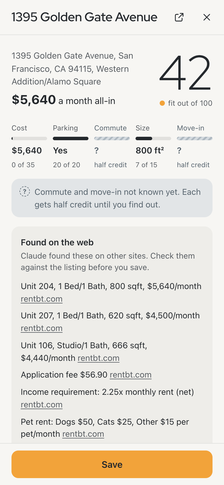

# I needed an apartment in a week, so I built the tool first

How I built Burnoff with Claude Code, used it to land an apartment in San Francisco, then opened it up for anyone to use.

[Try the demo](https://burnoff-sf.vercel.app) · [Read the code](https://github.com/cedson-cloud/burnoff-sf)

## The rule

Before the move, I set up a Claude Project with a housing playbook and a list of things Claude must never do. One line from that list went into the parse prompt, the scoring and, later, the phone lookup.

> Unknown is an acceptable answer. Fabrication is not.

I've spent 19 years in customer and operator roles, the last several in data infrastructure. On this build, Claude Code wrote the code. I wrote the spec, made the decisions, checked the results and ran every git command. When Claude Code says something is done, I treat that as a claim to check.

## A week to find an apartment

My girlfriend's new job in San Francisco started August 31. We drove out from Denver, and that first week we were homeless, staying with friends. I had one week to find a place before going back to pack. Four tours on an earlier trip had shown me how slow the search was by hand. Every listing meant rewriting a message for an owner or a property manager, adding up fees, checking commutes on Google Maps and guessing at fit.

I asked Claude for a simple app. It built a shared board as an artifact and told me I didn't need more. I pushed back, because the loop eating my day was finding a listing, retyping a message, sending it and forgetting who I'd chased. After about seven artifact versions in two days, each with a new link to re-send, I wrote a spec and Claude Code built a real app on Vercel.

You paste a listing page's text, and one Claude call fills in rent, fees, parking, size and move-in date. Anything the page doesn't say stays blank. Every place gets an all-in monthly cost and a score out of 100 against our criteria. Unknowns get half credit and a flag, so a listing with missing details stays in the running and shows what to ask. The first message comes in two versions, because individual owners decide on people and speed, while property managers decide on paperwork and turnaround.

Claude Code reported the app built, tested and passing every acceptance criterion. I checked the message templates first. One said something untrue about us, and a message had already gone out with it. An audit of every template found a second, and now templates only say what the profile says.

From August 31 to September 3, I booked or was in contact with seven properties. I found the one we got on Zillow the morning of August 31, toured it that day and applied that evening. It was approved September 2, and the lease was final September 4. My girlfriend had little time for the search that week, and the board let me take the lead while we both saw every place and its numbers.

## Making it public

In October I took our household out of the app, so it works solo or with anyone, and put up a public demo. Its board of invented listings lives in your browser, and pasting makes a live call to Claude on a separate key with a $10 monthly cap. If a parse fails, the demo shows a saved sample and says so. Anyone can deploy a private copy with one button.

## "It looks like AI slop"

That was my note once it was public, along with "I'm the only person who knows what to do in it, because I designed it." My girlfriend didn't know where to go or what to paste.

I set one test for the redesign. Someone new should be able to tell within ten seconds what the app is, what the top card means and what to tap next. On October 7, Claude Code critiqued every screen and ranked 12 problems, interviewed me on taste (Apple Weather for feel, Apple News for structure), and built three prototypes against the test. I picked one and took two parts from another, and Claude Code rebuilt the app in nine steps with before and after screenshots.

  
  

Two code reviews, one on coding standards and one on the spec, came to me before anything changed. They caught "Copy and mark sent" moving a listing backwards, from Applied to Inquired. They also caught a parking spot with no price showing as "Included". That's invented data, so it now says "Yes". The redesign went live the same day.

## The phone gap

Then I used it on my phone. Listing apps like Zillow and Redfin won't let you copy a page's text, so my README's "works everywhere" was wrong. iPhone Shortcuts worked for Zillow but not Redfin, and they were too fiddly to hand anyone. Screenshots meant too many per listing. A paid scraping API would break the app's free-tier rule. So I tested a Claude lookup on real listings. I gave it the link and the address, blocked the big listing sites, and told it to report only what it read on a page, with the source.

| Run | Time | Cost | Result |
|---|---|---|---|
| Edgewater, 355 Berry St | 12½ min | $1.51 | Found everything, all sourced |
| Same building, tighter budget | 55 sec | 38¢ | Skipped a page and wrongly said fees weren't itemized |
| 1395 Golden Gate Ave, told to report disagreements | 52 sec | 44¢ | Caught Redfin at $5,640 against the manager's own $5,895 |

The second run settled the design. On a tighter budget, Claude skipped a page and then stated something false. So in Find it with Claude, the lookup runs in the background, every found value shows its source, and anything missing or conflicting becomes a question for the tour. It costs about 40¢ a lookup.

  
  

Live, a lookup takes one to two minutes. Nothing goes on the board until you've checked the sources and tapped Save.
